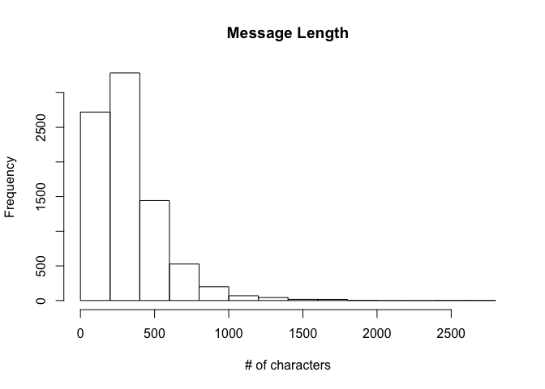
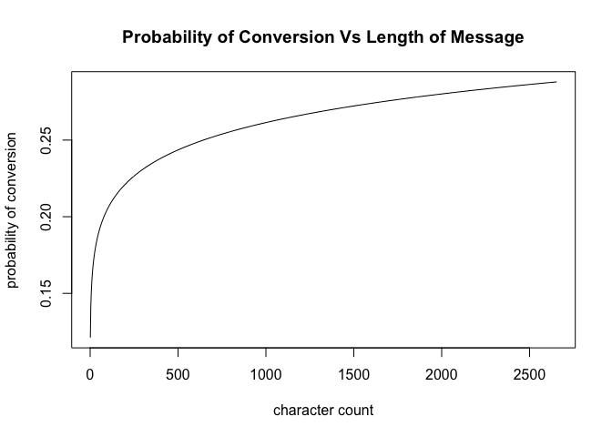
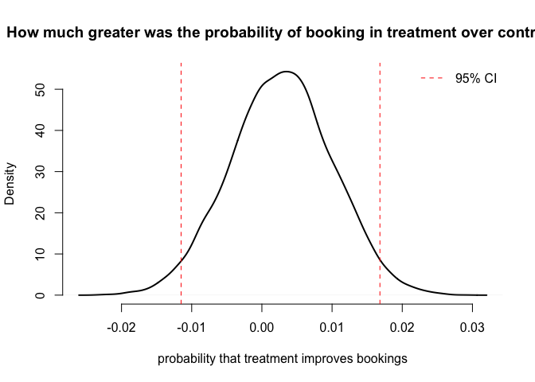

# Bayesian AB Testing
Mo Bhasin  
May 2015  
# Summary
A p2p tech company requires users (say U1) to ask members (say U2) on their site if they can buy/rent/use an item listed.
Sometimes U1 may send a long message to U2 asking for permission to use the item listed, sometimes he may not. 
The firm wanted to see if mandating a character limit (140 characters) would increase conversions. 
The data provided conntains the result of the AB test showing the conversions in the treatment and control group.
There are simple frequentist methods to answer whether or not this test worked,
I take a Bayesian approach since it helps answer the question "how much more effective was the test?" which is more insightful 
than "did it work?"


```r
require(dplyr)
require(lubridate)
load("data.Rdata") # Data exploration and cleaning not shown
```

Lets look at how the tratment and contol is split up, 0 is did not convert 1 is did convert 


```r
# FREQUENTIST ANALYSIS
x2 <- x 
# timestamp in log file implies conversion
x2[,grepl("ts",names(x2))] <- ifelse(is.na(x2[,grepl("ts",names(x2))]), 0, 1)
print(tbl <- table(x2$ab,x2$ts_booking_at))
```

```
##            
##                0    1
##   control   3173 1024
##   treatment 3175 1044
```

```r
chisq.test(tbl) 
```

```
## 
## 	Pearson's Chi-squared test with Yates' continuity correction
## 
## data:  tbl
## X-squared = 0.11847, df = 1, p-value = 0.7307
```

Chi-squared test reveals whether columns are indep. 
i.e. does converting depend on whether you were in the control or in the treatment 
a p-val of 0.7 >0.05 indicates that they are not indep, i.e the A/B test was not successful  
**Why did we think mandating a minimum character count was a good idea?**  
Let's look at how are data is distributed? How many characters do messages usually have?


```r
hist(x[,9], main="Message Length", xlab="# of characters")
```

 

Does increasing the number of characters increase the likelihood of conversion


```r
x3 <- x$m_first_message_length
x3[is.na(x3) | x3 == 0] <- 1
y1 <- x2$ts_booking_at
df <- data.frame(x=log(x3), y=y1)
fit <- glm(y ~ x, family="binomial", data=df)
ndf <- data.frame(x=log(seq(1, max(x3), length=1000)))
p <- predict(fit, newdata=ndf, type="response")
plot(exp(ndf$x), p, type="l", xlab="character count", ylab="probability of conversion" , main="Probability of Conversion Vs Length of Message")
```

 

**YES! It does **


```r
# SPLIT INTO CONTROL/EXP
cont <- x[x$ab=="control",]
cont[,grepl("ts",names(cont))] <- ifelse( is.na(cont[,grepl("ts",names(cont))]), 0, 1)
expr <- x[x$ab=="treatment",]
expr[,grepl("ts",names(expr))] <- ifelse( is.na(expr[,grepl("ts",names(expr))]), 0, 1)

# BAYESIAN ANALYSIS
BinomInf <- function (data){
  
  ##   GIVEN CONJUGATE UNIFORM (BETA(1,1)) PRIOR & BINOM SAMPLING MODEL         ##
  ##   COMPUTES POSTERIOR MEAN & CI ##
  
  y <- sum(data) 
  n <- length(data) 
  a <- 1+y
  b <- 1+n-y
  
  theta <- seq(0,1,length=1000)
  post.beta <- dbeta(theta, a, b)
  post.mean <- a/(a+b) # Print this
  
#   This output surpressed for github prettiness
#   plot(theta, post.beta, type="l", lwd=2,
#        ylab="density", xlab="theta", bty="n")
#   abline(v=post.mean, col="2", lty=2)
#   legend(x="topright", bty="n", c("posterior", paste("Mean =", round(post.mean, 3))),
#          lty=1:2, col=1:2)  
  
  return(rbeta(10000,a,b))
}
```

```r
par(mfrow=c(2,1))
theta.cont <- BinomInf(cont$ts_booking_at)
theta.expr <- BinomInf(expr$ts_booking_at)

mean(theta.expr>theta.cont)
```

```
## [1] 0.6503
```

```r
# PROBABILITY DISTRIBUTION THAT EXPRIMENT > CONTROL
dtheta <- theta.expr - theta.cont
par(mfrow=c(1,1))
print(q.theta <- quantile(dtheta, c(0.025, 0.975)))
```

```
##        2.5%       97.5% 
## -0.01151209  0.01681703
```

```r
plot(density(dtheta), lwd=2, bty="n", main="How much greater was the probability of booking in treatment over control?", xlab = "probability that treatment improves bookings")
abline(v=q.theta, col=2, lty=2)
legend(x="topright", bty="n", c("95% CI"),lty=2, col=2) 
```

 

The graph above shows how much better the control was than the treatment. Answer: 0%

---
title: "Bayesian_ABtest.R"
author: "mosmbp"
date: "Thu Sep 10 16:04:17 2015"
---
